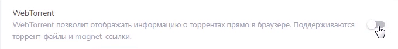
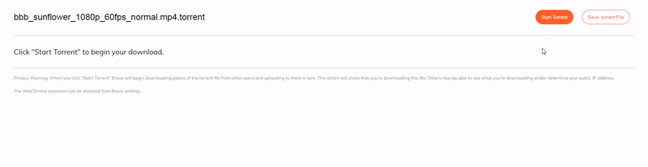
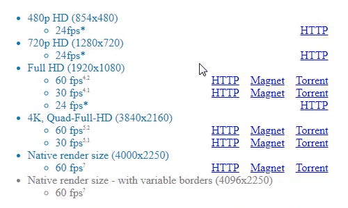

[Brave](https://lrtracker.me/go/1eb14876-8d37-4877-a890-97a2e1cc04f0?article=brave-torrent) — браузер на основе Chromium, анонсированный соучредителем корпорации Mozilla Project и создателем JavaScript Бренданом Эйхом. Создатели включили в Brave немало интересных функций, среди которых автоматическая блокировка рекламы, встроенный VPN/TOR клиент, и даже возможность заработка криптовалюты. Однако сегодня мы затронем еще одну полезную фичу данного браузера.

[Brave](https://lrtracker.me/go/1eb14876-8d37-4877-a890-97a2e1cc04f0?article=brave-torrent) поддерживает работу с торрентами прямо из коробки. Это значит, что для загрузки содержимого раздачи Вам совсем не обязательно иметь на своем ПК установленный торрент-клиент.

Разумеется, идея загрузки торрентов в браузере совсем не нова. В какие-то эта функция встроена, в других можно воспользоваться сторонними расширениями. Однако, [браузер Brave](https://lrtracker.me/go/1eb14876-8d37-4877-a890-97a2e1cc04f0?article=brave-torrent) предоставляет нам возможность не только загрузить файлы, но и просмотреть/прослушать видео и аудио из торрент-раздач.

Как это работает? Первым делом стоит убедиться, что в настройках браузера включено расширение WebTorrent (chrome://settings/extensions). Условие выполнено? Тогда можно приступать к просмотру содержимого торрентов.

  
	<figcaption class="css-11o8ky7 e1xodvy30">Активация расширения WebTorrent</figcaption>

Для начала нам понадобится найти желаемую раздачу, содержащую видео- или аудио-контент: фильм, сериал, другой видеоконтент, музыка, или аудиокнига. Затем достаточно кликнуть на ссылку загрузки торрент-файла (.torrent) или магнет-ссылку, после чего откроется интерфейс работы с раздачей.

  
	<figcaption class="css-11o8ky7 e1xodvy30">Управления загрузкой</figcaption>

На данной странице находятся всего две кнопки, так что, недолго думая, жмем на кнопку Start Torrent. После этого начнется загрузка торрента, а перед нами предстанет список файлов. Теперь мы можем запустить потоковое воспроизведение желаемого аудио- или видеоролика, не дожидаясь окончания полной загрузки раздачи, кликнув по соответствующему файлу.

  
	<figcaption class="css-11o8ky7 e1xodvy30">Режим "картинка в картинке"</figcaption>

Плеер обладает максимально простым функционалом, однако одна занятная особенность в нем все-таки имеется. Пользователь может запустить видео в режиме "картинка в картинке". Благодаря ему появляется возможность просматривать ролик в небольшом окне, как занимаясь серфингом веб-страниц в [браузере](https://lrtracker.me/go/1eb14876-8d37-4877-a890-97a2e1cc04f0?article=brave-torrent), так и во время работы с другими приложениями.

  
	<figcaption class="css-11o8ky7 e1xodvy30">Для перехода к загрузке и просмотру содержимого достаточно кликнуть на ссылку</figcaption>

При наличии достаточной высокой пропускной способности сети и соответствующего количества находящихся на раздаче пиров и сидов, ролики воспроизводятся без каких-либо намеков на тормоза и подгрузки. К слову, просмотр видео с разрешением 4К и частотой в 60 кадров кадров в секунду, не вызвал никаких проблем.

Но не обошлось и без ложки дегтя. К сожалению, список поддерживаемых видео-форматов ограничен следующим списком: m4v, mkv, mp4, webm. При попытке открыть весьма распространенный формат avi пользователь потерпит неудачу. Кстати, самостоятельно протестировать работу с торрентами Вы сможете по [этой](https://lrtracker.me/go/1eb14876-8d37-4877-a890-97a2e1cc04f0?article=brave-torrent) ссылке (контент размещен под лицензией Creative Commons).

Разумеется, [Brave Browser](https://lrtracker.me/go/1eb14876-8d37-4877-a890-97a2e1cc04f0?article=brave-torrent) предоставляет весьма ограниченный функционал для работы с торрент-файлами, так что полноценной заменой клиента его назвать сложно. Однако, это интересная альтернатива в том случае, если у пользователя нет возможности установить стороннее приложение, либо требуется запустить потоковое воспроизведение файлов раздачи. Стоит отметить, что в бесплатных версиях многих торрент-клиентов эта функция отсутствует.

Канал Brave Friends участвует в партнерской программе [браузера Brave](https://lrtracker.me/go/1eb14876-8d37-4877-a890-97a2e1cc04f0?article=brave-torrent). Загрузить его Вы можете по нашим [ссылкам](https://lrtracker.me/go/1eb14876-8d37-4877-a890-97a2e1cc04f0?article=brave-torrent).